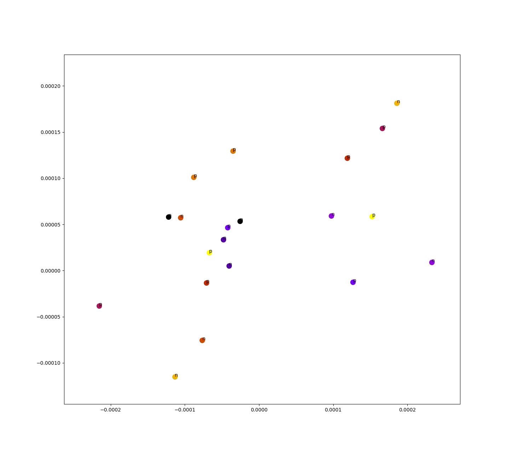

# Paraphrase detection

The goal of this project is to detect if two sentences are paraphrases.

Done for CSC 485: Natural Language processing at the University of Victoria, taught by Dr. Alona Fyshe.

## Usage

1. Install [conda](https://conda.io/docs/install/quick.html#id1) (I use miniconda on Linux)

2. Create the python environment

```
$ conda env create -f env.yml
```

3. Activate the environment
```
$ source activate ml
# On Windows: activate ml
```

3. Change variables in `lstm/train.py`

You will probably want to change the path variables such as train/test data, and the checkpoint and logging directories.

4. Run

`jupyter notebook` to checkout the notebooks, `cd lstm && python train.py` to train the RNN. Might wanna change the variables at the top of `train.py`

5. View logs on tensorboard

```
$ tensorboard --logdir <path to tensorboard logs>
```

## Methodology

The basic approach:

1. Create vectors from sentences
2. Calculate distance
3. Interperate boundary

The logic behind this is that sentences that are similar are going to have
vector representations that are similar.

