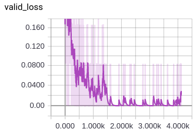
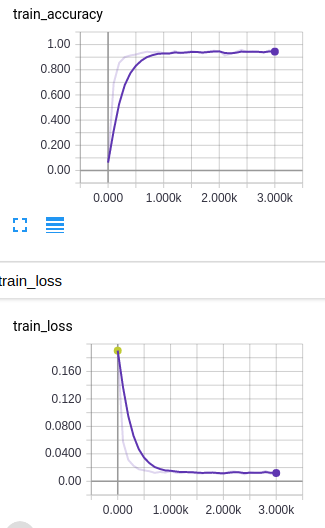
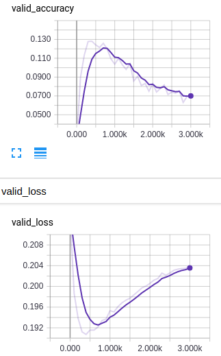

# Results

## Count vectorization

We used count vectorization to generate vectors for each sentence, then calculated
the cosine distance between the two sentences. We then tried several classifiers
to create and intelligent decision boundary to interperate the results.

To ensure our classifier was not constantly predicting the same values calculated
the accuracy

The intuition behind using cosine similarity can be visualized by looking at a 

### Cosine Distance + Logistic Regression

Using logistic regression and the computed cosine distance we got a test accuracy
of 69.93%

### Cosine Distance + SVM

70.67% test

### Cosine Distance concated w/ feature vectors + Gradient Boosted Trees

71.6% test

## Word2Vec vectors

The second thing we tried was creating our sentence vectors using word2vec by
creating a word vector for each word, then adding all the vectors for each sentence
together. We then calculating the cosine distance between these sentence vectors
and using a classifier to draw a decision boundary.

### Gradient boosting trees

We tried several classifiers but Gradient Boosted trees performed the best,
acheiving 72.87% with the concatenated word vectors and consine distance

## Siamese LSTM

We tried a few different approached to Siamese LSTMs

- Siamese LSTM using a vector for each word generated by pre-trained word2vec
    - loss converged but accuracy went down as loss went down
    
    

- Siamese LSTM and training a custom embedding layer for each LSTM
    - Never converged (not enough data)

- Siamese LSTM using count vectorization for sentence vectors
    - similiar in trend of loss/accuracy to word2vec vectors but performed worse (56.3% valid)

## Linear layer after word2vec

We trained a neural network that took a vectors produced by word2vec and
trained linear layer, then calculated the cosine distance, then used
the cosine distance to calculate MSE with a binary 1 or 0 depending on if the two sentences were actually paraphrases. This allowed us to learn how to better generate our sentence vectors. This resulted in a training accuracy of 94.28%, but a validation accuracy of under 10%.

