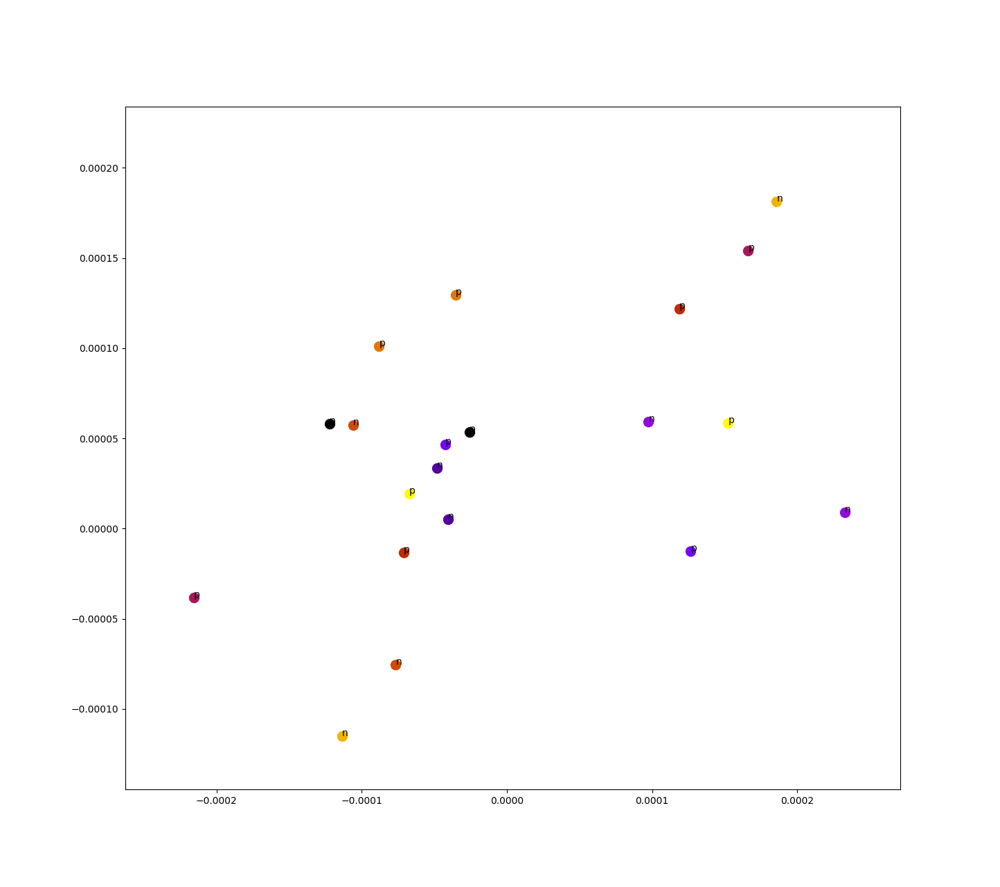

# Images

## TSNE embeddings

10 sentence pairs, sentence couplets are same color, labeled `P` if they actually are a paraphrase, `N` if not a paraphrase.

100 sentence pairs, sentence couplets are same color

10 sentence pairs, sentence couplets are same color, labeled `P` if they actually are a paraphrase, `N` if not a paraphrase.

(Lower perplexity when training TSNE)
