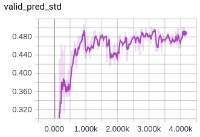

# Siamese LSTM from embedded vocab

## Usage

1. Activate conda env (see README at root)

2. Change variables in `main.py`. You will probably want to change these:

```
tensor_board_log_dir = '/home/erik/Desktop/sia_logs/runs/' + str(start) + '/'
checkpoint_path = '/home/erik/Desktop/sia_checkpoints'
train_path = '../small_data/train.csv'
test_path = '../small_data/test.csv'
```

3. Start `tensorboard` (included in conda env)
```
$ tensorboard --logdir <tensor_board_log_dir>
```

4. Train
```
$ python main.py
```

## Current parameters

This model is currently using `L1Loss`, `ADAM` as an optimizer, 126 features in hidden layer of the LSTM, 2 recurrent layers.

Here are graphs of training data over 4000 epochs:

Validation accuracy


Validation loss


Validation STD (just a check to make sure predictions are changing over time)
